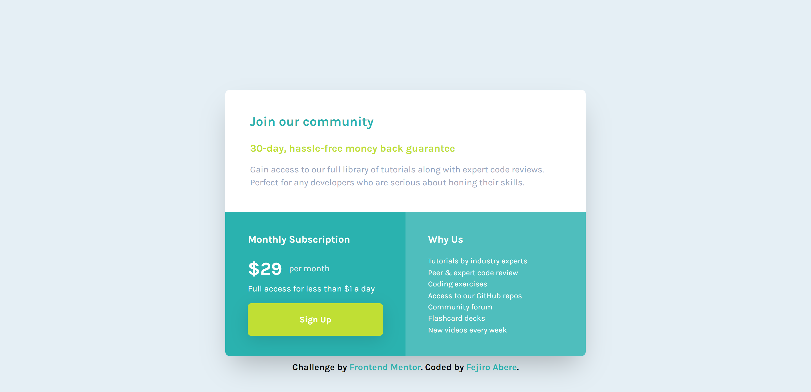

# Frontend Mentor - Single price grid component solution

This is a solution to the [Single price grid component challenge on Frontend Mentor](https://www.frontendmentor.io/challenges/single-price-grid-component-5ce41129d0ff452fec5abbbc). Frontend Mentor challenges help you improve your coding skills by building realistic projects.

## Table of contents

- [Overview](#overview)
  - [The challenge](#the-challenge)
  - [Screenshot](#screenshot)
  - [Links](#links)
- [My process](#my-process)
  - [Built with](#built-with)
  - [What I learned](#what-i-learned)
  - [Continued development](#continued-development)
  - [Useful resources](#useful-resources)
- [Author](#author)

## Overview

### The challenge

Users should be able to:

- View the optimal layout for the component depending on their device's screen size
- See a hover state on desktop for the Sign Up call-to-action

### Screenshot




### Links

- Solution URL: [Solution URL](https://your-solution-url.com)
- Live Site URL: [Live Site URL](https://single-price-grid-component-master-mu-hazel.vercel.app/)

## My process

### Built with

- Semantic HTML5 markup
- Tailwind CSS - For styles
- Flexbox
- CSS Grid
- ESLint
- Prettier
- Mobile-first workflow
- [React](https://reactjs.org/) - JS library
- Vite

### What I learned

Created a custom scrollbar.
Installed a package to display a toast after the sign up button is clicked.

```css
/* width */
::-webkit-scrollbar {
  width: 10px;
}

/* Track */
::-webkit-scrollbar-track {
  @apply bg-white;
}

/* Handle */
::-webkit-scrollbar-thumb {
  @apply bg-cyan;
  border-radius: 5px;
}

/* Handle on hover */
::-webkit-scrollbar-thumb:hover {
  @apply bg-bright-yellow;
}
```

```jsx
const notify = () =>
  toast.success("Sign up successful!", { theme: "dark", autoClose: 1500 });
```

### Continued development

Create a cleaner codebase

### Useful resources

- [Tailwind CSS Box Shadows](https://manuarora.in/boxshadows) - Got box shadows from this site.

## Author

- Frontend Mentor - [@Fejiro001](https://www.frontendmentor.io/profile/Fejiro001)
- Twitter - [@aberefejiro](https://www.twitter.com/aberefejiro)
